# com.thirdlib.prefab 插件

## 1. 插件概述

`com.thirdlib.prefab` 是一个 Gradle 插件，用于将 Conan 管理的 C++ 依赖打包成 Android Prefab 格式，并支持两种使用场景。

## 2. 为什么需要这个插件？

### AGP Prefab 的能力边界

AGP 内置的 Prefab 支持（`buildFeatures.prefab true`）**仅能处理**：

| 功能 | AGP 支持 |
|------|----------|
| 单模块 Prefab 打包 | ✅ |
| 静态库/动态库 | ✅ |
| 头文件目录 | ✅ |
| Consumer 依赖解析 | ✅ |

### AGP Prefab 的局限性

| 场景 | AGP 支持 | prefab-plugin 解决方案 |
|------|----------|------------------------|
| Conan 依赖管理 | ❌ | `conanInstall` + `collectConanPackages` |
| 多模块 Prefab 生成 | ❌ | `generateConanPrefab` 动态生成 |
| Conan 包路径解析 | ❌ | `CollectPackagesTask` 执行 `conan graph info` |
| 动态依赖发现 | ❌ | 解析 `conanfile.py` 自动发现 |
| AAR 后处理（清理 .so） | ❌ | `CleanJniLibsTask` |
| Prefab 注入 AAR | ❌ | `InjectAarTask` |

**结论**：插件的核心价值是**桥接 Conan 生态与 Android Prefab 生态**。

---

## 3. 架构图

### 3.1 整体架构

```mermaid
flowchart TB
    subgraph Plugin["com.thirdlib.prefab 插件"]
        subgraph ConfigLayer["配置层"]
            Extension["ConanPrefabExtension"]
        end
        subgraph Scenario1["场景 1: Conan 注入 Prefab"]
            A["conanInstall"] --> B["collectPackages"] --> C["externalNativeBuild"] --> D["generateModules"] --> E["bundleReleaseAar"] --> F["injectConanPrefabIntoAar"]
        end
        subgraph Scenario2["场景 2: 清理传递依赖"]
            G["cleanTransitiveJniLibs"]
        end
    end
    subgraph AGP["AGP 任务"]
        H["assembleRelease"] --> I["publish"]
    end
    Extension --> |"injectConanPrefab=true"| Scenario1
    Extension --> |"cleanTransitiveJniLibs=true"| Scenario2
    E -.-> |"finalizedBy"| G
    F --> H
    G --> H
    style Plugin fill:#1a1a2e,stroke:#fff
    style ConfigLayer fill:#16213e,stroke:#0f3460,stroke-width:2
    style Scenario1 fill:#0f3460,stroke:#e94560
    style Scenario2 fill:#533483,stroke:#e94560
    style AGP fill:#1a1a2e,stroke:#e94560
    style Extension fill:#e94560,stroke:#fff,color:#fff
    style A fill:#e94560,color:#fff
    style B fill:#e94560,color:#fff
    style C fill:#e94560,color:#fff
    style D fill:#e94560,color:#fff
    style E fill:#e94560,color:#fff
    style F fill:#e94560,color:#fff
    style G fill:#e94560,color:#fff
    style H fill:#e94560,color:#fff
    style I fill:#e94560,color:#fff
```



### 3.2 场景 1 任务流程


### 3.3 场景 2 任务流程


---

## 4. 两种场景对比

| 维度 | 场景 1：Conan 注入 | 场景 2：清理传递依赖 |
|------|-------------------|---------------------|
| 配置开关 | `injectConanPrefab = true` | `cleanTransitiveJniLibs = true` |
| 必要变量 | `conanfile`, `profile`, `abis` | `libraryName` |
| 用途 | 使用 Conan 管理依赖 | 使用 Gradle Prefab，清理传递依赖 |
| 任务 | `conanInstall`, `collectPackages`, `generateModules`, `injectAar` | `cleanTransitiveJniLibs` |
| 保留的 .so | 所有 Conan 依赖的库 | 只有 `lib${libraryName}.so` |
| 典型模块 | `lib` | `mycurl` |

---

## 5. 接入方式

### 5.1 场景 1：lib 模块（Conan 注入 Prefab）

```groovy
// build.gradle
plugins {
    id 'com.android.library'
    id 'maven-publish'
    id 'com.thirdlib.prefab'
}

conanPrefab {
    libraryName = 'thirdpartylib'
    libraryVersion = '1.0.0'
    conanfile = 'conanfile.py'
    profile = 'android.profile'
    abis = ['arm64-v8a', 'armeabi-v7a']
    minSdk = 26
    stl = 'c++_shared'

    // 开启场景1
    injectConanPrefab = true
}

android {
    defaultConfig {
        ndk {
            abiFilters 'arm64-v8a', 'armeabi-v7a'
        }

        externalNativeBuild {
            cmake {
                arguments "-DCMAKE_TOOLCHAIN_FILE=conan_android_toolchain.cmake"
            }
        }
    }

    buildFeatures {
        prefab false  // 不使用 AGP 内置 Prefab
    }
}
```

**CMakeLists.txt**：
```cmake
cmake_minimum_required(VERSION 3.22.1)
project(thirdpartylib)

add_library(thirdpartylib SHARED src/main/cpp/native-lib.cpp)

find_package(ZLIB REQUIRED CONFIG)
find_package(OpenSSL REQUIRED CONFIG)
find_package(CURL REQUIRED CONFIG)

target_link_libraries(thirdpartylib
    ZLIB::ZLIB
    OpenSSL::Crypto
    OpenSSL::SSL
    CURL::libcurl
)
```

### 5.2 场景 2：mycurl 模块（清理传递依赖）

```groovy
// build.gradle
plugins {
    id 'com.android.library'
    id 'maven-publish'
    id 'com.thirdlib.prefab'
}

android {
    namespace 'com.thirdlib.mycurl'
    compileSdk rootProject.ext.compileSdk

    defaultConfig {
        minSdk rootProject.ext.minSdk
        ndk {
            abiFilters 'arm64-v8a', 'armeabi-v7a'
        }

        externalNativeBuild {
            cmake {
                arguments "-DANDROID_STL=c++_shared"
            }
        }
    }

    buildFeatures {
        prefab true
        prefabPublishing true
    }

    prefab {
        mycurl {
            headers = "src/main/cpp"
            libraryName = "libmycurl"
        }
    }
}

dependencies {
    implementation 'com.thirdlib:thirdpartylib:1.0.0'
}

conanPrefab {
    libraryName = 'mycurl'
    injectConanPrefab = false
    cleanTransitiveJniLibs = true
}
```

**CMakeLists.txt**：
```cmake
cmake_minimum_required(VERSION 3.22.1)
project(mycurl)

add_library(mycurl SHARED src/main/cpp/mycurl.cpp)

find_package(thirdpartylib REQUIRED CONFIG)
target_link_libraries(mycurl PRIVATE thirdpartylib::curl)
```

---

## 6. Demo 工程模拟的现实场景

### 6.1 模块结构

```
android-cxx-thirdpartylib/
├── lib/                      # 场景1：Conan 管理依赖，打包成 Prefab
│   ├── conanfile.py         # Conan 依赖声明
│   ├── conan_android.toolchain.cmake
│   ├── CMakeLists.txt
│   └── src/main/cpp/
│
├── mycurl/                  # 场景2：使用 Prefab，清理传递依赖
│   ├── CMakeLists.txt
│   └── src/main/cpp/
│
└── app/                      # 测试模块，同时依赖两者
    ├── build.gradle
    └── src/main/cpp/
```

### 6.2 模拟场景对照表

| Demo 模块 | 模拟的现实场景 | 技术要点 |
|-----------|---------------|---------|
| `lib` | **Native SDK 发布** | Conan 管理版本依赖，打包成 AAR + Prefab |
| `mycurl` | **封装层模块** | 依赖其他 Native SDK，只暴露自己，不打包传递依赖 |
| `app` | **App 集成** | 同时依赖多个 Native SDK，Prefab 自动解析 |

### 6.3 Maven 仓库与依赖关系

```mermaid
flowchart TB
    subgraph Maven["Maven 仓库"]
        A["thirdpartylib 1.0.0<br/>Prefab: curl, ssl, crypto, zlib<br/>jni: 所有.so"]
        B["mycurl 1.0.0<br/>Prefab: mycurl<br/>jni: 仅 mycurl.so"]
    end
    subgraph App["App Module"]
        C["dependencies<br/>implementation thirdpartylib<br/>implementation mycurl"]
        D["CMake<br/>find_package(thirdpartylib)<br/>find_package(mycurl)"]
    end
    subgraph APK["APK 输出"]
        E["libcurl.so ← thirdpartylib"]
        F["libssl.so ← thirdpartylib"]
        G["libcrypto.so ← thirdpartylib"]
        H["libz.so ← thirdpartylib"]
        I["libmycurl.so ← mycurl"]
        J["libc++_shared.so ← STL"]
    end
    A --> C
    B --> C
    C --> D
    D --> E
    D --> F
    D --> G
    D --> H
    D --> I
    D --> J
    style A fill:#1a1a2e,stroke:#00d4ff,color:#fff
    style B fill:#1a1a2e,stroke:#00d4ff,color:#fff
    style App fill:#0f3460,stroke:#e94560
    style APK fill:#533483,stroke:#fff
    style C fill:#e94560,color:#fff
    style D fill:#e94560,color:#fff
    style E fill:#0f3460,color:#fff
    style F fill:#0f3460,color:#fff
    style G fill:#0f3460,color:#fff
    style H fill:#0f3460,color:#fff
    style I fill:#0f3460,color:#fff
    style J fill:#0f3460,color:#fff
```



---

## 7. 文件结构

```
prefab-plugin/src/main/groovy/com/thirdlib/prefab/
├── ConanPrefabExtension.groovy     # 扩展 DSL，定义配置属性
├── ConanPrefabPlugin.groovy        # 插件入口，编排任务
└── tasks/
    ├── ConanInstallTask.groovy     # 执行 conan install
    ├── CollectPackagesTask.groovy  # 收集 Conan 包路径
    ├── GenerateModulesTask.groovy  # 生成 Prefab 模块结构
    ├── InjectAarTask.groovy        # 将 Prefab 注入 AAR
    └── CleanJniLibsTask.groovy     # 清理传递依赖的 .so
```

---

## 8. 构建命令

```bash
# 场景1：构建并发布 lib 模块
./gradlew :lib:assembleRelease
./gradlew :lib:publish

# 场景2：构建 mycurl 模块
./gradlew :mycurl:assembleRelease

# App 集成测试
./gradlew :app:assembleDebug

# 验证 AAR 内容
unzip -l lib/build/outputs/aar/lib-release.aar | grep "prefab"
unzip -l mycurl/build/outputs/aar/mycurl-release.aar | grep "\.so"

# 验证 APK 内容
unzip -l app/build/outputs/apk/debug/app-debug.apk | grep "\.so"
```

---

## 9. 版本信息

- **AGP**: 8.3.2
- **Gradle**: 8.12.1
- **Min SDK**: 26
- **NDK**: 26.0.10892812
- **Conan**: 2.x
